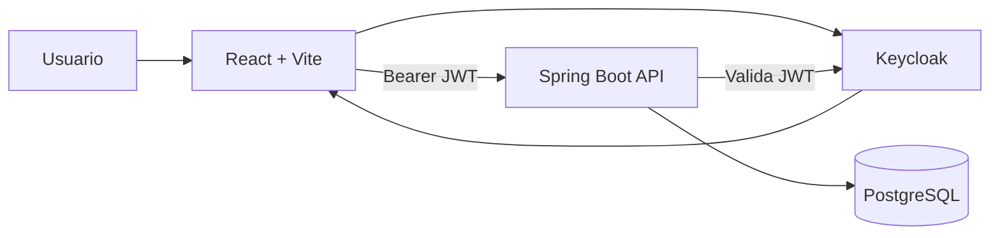
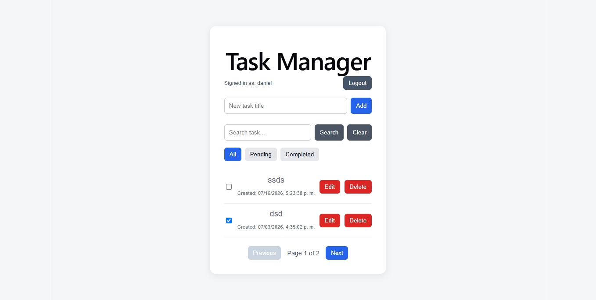
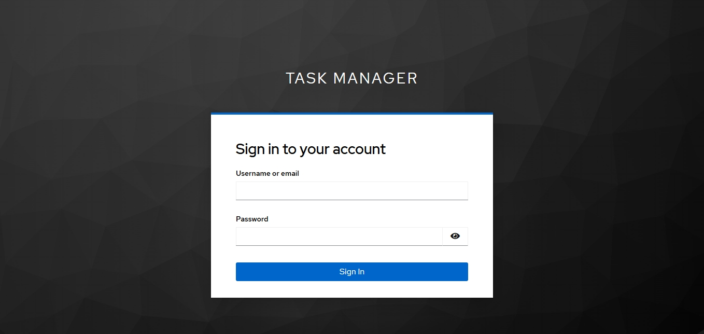

# Task Manager

Aplicación web full stack para la gestión de tareas personales, desarrollada como proyecto práctico para reforzar React, Spring Boot, PostgreSQL, Docker, seguridad con Keycloak, migraciones, testing y CI.

## Características

* Autenticación mediante Keycloak y OpenID Connect.
* API protegida con JWT.
* Gestión multiusuario.
* Cada usuario únicamente puede consultar y modificar sus propias tareas.
* Creación, edición, finalización y eliminación de tareas.
* Búsqueda de tareas por título.
* Filtros por estado: todas, pendientes y completadas.
* Paginación.
* Ordenamiento por fecha de creación.
* Validación de solicitudes.
* Manejo global de errores.
* Migraciones versionadas con Flyway.
* Health checks de Docker.
* Tests unitarios, de controlador y de integración.
* Integración continua con GitHub Actions.

## Tecnologías

### Frontend

* React
* Vite
* JavaScript
* CSS
* Keycloak JS

### Backend

* Java 17
* Spring Boot
* Spring Web
* Spring Data JPA
* Spring Security
* OAuth2 Resource Server
* Bean Validation
* Flyway
* Lombok

### Infraestructura

* PostgreSQL 16
* Keycloak
* Docker
* Docker Compose
* GitHub Actions
* Testcontainers

## Arquitectura



El navegador autentica al usuario mediante Keycloak. Después, React envía el token JWT en cada solicitud hacia la API.

Spring Security valida el token y el backend utiliza el usuario autenticado para restringir el acceso a las tareas de su propietario.

## Estructura

```text
01-task-manager/
├── .github/
│   └── workflows/
│       └── ci.yml
├── backend/
├── frontend/
├── keycloak/
│   └── task-manager-realm.json
├── docs/
│   └── screenshots/
├── docker-compose.yml
├── .env.example
└── README.md
```

## Ejecución local

### Requisitos

* Docker Desktop
* Docker Compose
* Git

### Configuración

Clonar el repositorio:

```bash
git clone https://github.com/DanielDGe/01-task-manager.git
cd 01-task-manager
```

Crear el archivo de variables de entorno:

```bash
cp .env.example .env
```

En Windows PowerShell:

```powershell
Copy-Item .env.example .env
```

Revisar y ajustar las credenciales de desarrollo incluidas en `.env`.

### Levantar la aplicación

```bash
docker compose up -d --build
```

Verificar los contenedores:

```bash
docker ps
```

Servicios:

| Servicio   | Dirección             |
| ---------- | --------------------- |
| Frontend   | http://localhost:5173 |
| Backend    | http://localhost:8080 |
| Keycloak   | http://localhost:8180 |
| PostgreSQL | localhost:5432        |

La primera inicialización de Keycloak puede tardar varios minutos.

## Usuario local de demostración

El realm importado incluye un usuario únicamente para desarrollo:

```text
Usuario: daniel
Contraseña: TaskManager123!
```

Estas credenciales no deben utilizarse en producción.

Se pueden crear usuarios adicionales desde la consola administrativa de Keycloak para comprobar el aislamiento multiusuario.

## Endpoints

Todos los endpoints de tareas requieren un token Bearer válido.

### Health check público

```http
GET /api/health
```

### Listar tareas

```http
GET /api/tasks
```

Parámetros opcionales:

```text
completed=true|false
search=texto
```

### Listar con paginación

```http
GET /api/tasks/page?page=0&size=5
```

Parámetros opcionales:

```text
completed=true|false
search=texto
```

### Consultar una tarea

```http
GET /api/tasks/{id}
```

### Crear una tarea

```http
POST /api/tasks
Content-Type: application/json
```

```json
{
  "title": "Nueva tarea",
  "description": "Descripción",
  "completed": false
}
```

### Actualizar una tarea

```http
PUT /api/tasks/{id}
Content-Type: application/json
```

```json
{
  "title": "Tarea actualizada",
  "description": "Nueva descripción",
  "completed": true
}
```

### Eliminar una tarea

```http
DELETE /api/tasks/{id}
```

Un usuario no puede consultar, editar ni eliminar tareas pertenecientes a otro usuario.

## Migraciones

Flyway controla la evolución de la base de datos:

```text
V1__create_tasks_table.sql
V2__add_task_timestamps.sql
V3__add_task_owner.sql
```

Consultar el historial:

```sql
select version, description, success
from flyway_schema_history;
```

## Tests

Ejecutar los tests del backend:

```powershell
cd backend
.\mvnw.cmd clean test
```

En Linux o macOS:

```bash
cd backend
./mvnw clean test
```

La suite incluye:

* Tests unitarios con JUnit y Mockito.
* Tests del controlador con MockMvc.
* Tests de integración con PostgreSQL mediante Testcontainers.
* Ejecución de migraciones Flyway dentro del contenedor temporal.

## Integración continua

GitHub Actions ejecuta automáticamente:

* Compilación del frontend.
* Instalación limpia mediante `npm ci`.
* Tests del backend.
* Integración con PostgreSQL mediante Testcontainers.

Workflow:

```text
.github/workflows/ci.yml
```

## Comandos útiles

Detener servicios:

```bash
docker compose down
```

Detener servicios y eliminar volúmenes:

```bash
docker compose down -v
```

Reconstruir solamente el backend:

```bash
docker compose up -d --build backend
```

Reconstruir solamente el frontend:

```bash
docker compose up -d --build frontend
```

Ver logs del backend:

```bash
docker logs task-manager-api --tail=100
```

Ver logs de Keycloak:

```bash
docker logs task-manager-keycloak --tail=100
```

Entrar a PostgreSQL:

```bash
docker exec -it task-manager-db psql -U admin -d task_manager
```

## Capturas

### Aplicación



### Inicio de sesión



## Estado del proyecto

Versión inicial funcional con:

* Frontend React.
* API REST con Spring Boot.
* Base de datos PostgreSQL.
* Autenticación con Keycloak.
* Seguridad JWT.
* Aislamiento multiusuario.
* Docker Compose.
* Migraciones Flyway.
* Tests automatizados.
* Integración continua.
